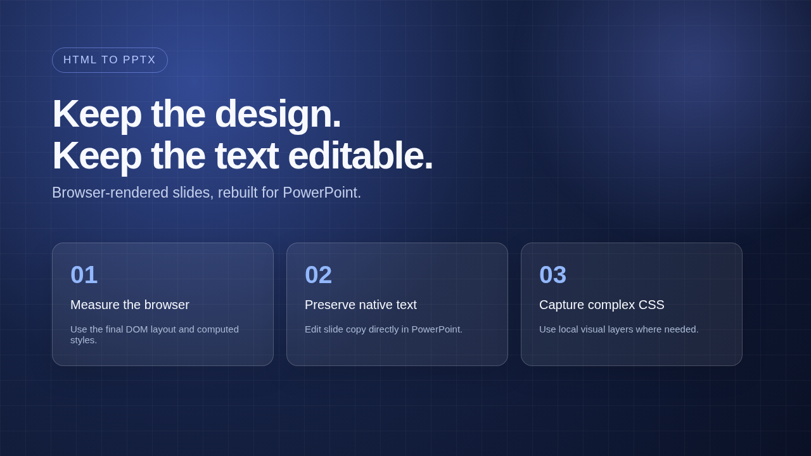
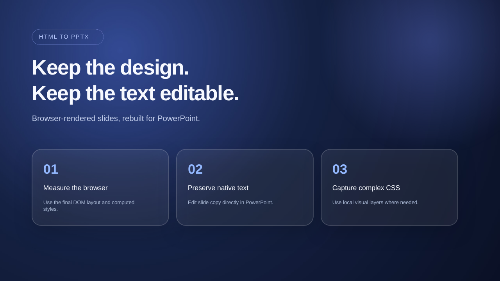
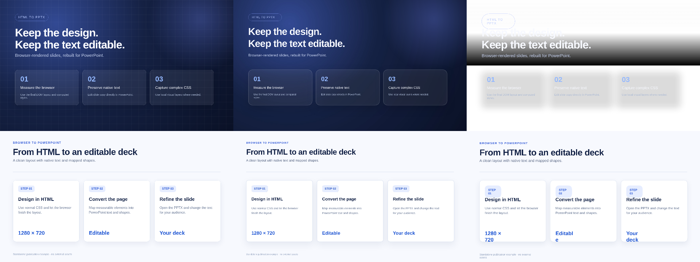

# HTML to editable PPTX

Convert a browser-rendered HTML slide into a PowerPoint file with **native editable text** and mapped shapes. Complex CSS decorations are captured as local images when needed, so the slide stays visually close to the browser.

[中文说明](docs/README.zh-CN.md) · [How editability is demonstrated](docs/EDITABILITY.md)

## See the result

| Original HTML in Chrome | Exported PPTX rendered by LibreOffice |
| --- | --- |
|  |  |

[Download this editable PPTX](docs/media/gradient-slide.pptx) · [Watch the 9-second text edit proof](docs/media/editability-proof.mp4)

The clip shows a native PPTX text run changed in the file and re-rendered. It is **not a recording of someone typing in the PowerPoint interface**. The slide has 14 editable text boxes; two complex decorations become local images.

## Compare with another exporter



Columns are **HTML / this exporter / dom-to-pptx 2.1.2**. The dark slide demonstrates a visual strength; the light slide shows a case where the comparison tool scores better. [Benchmark details](benchmarks/README.md).

[Open the edited PPTX](docs/media/gradient-slide-edited.pptx) · [How editability was verified](docs/EDITABILITY.md)

## Try it locally

Requirements: Node.js 18+, Chrome or Chromium. The demo and CLI have been tested on Linux with Google Chrome.

Install directly from GitHub in one command:

```bash
npm install github:H777000/html-to-editable-pptx
```

Then convert one HTML file, passing the path to your Chrome executable if needed:

```bash
npx html-to-editable-pptx slide.html --output slide.pptx --chrome /usr/bin/google-chrome
```

To run the browser demo from source:

```bash
git clone https://github.com/H777000/html-to-editable-pptx.git
cd html-to-editable-pptx
npm ci
npm run demo
```

Open `http://127.0.0.1:4173`, inspect the HTML slide, and click **Download PPTX**. This demo uses original example HTML with no external assets.

### Convert one HTML slide from the command line

```bash
node bin/convert.cjs examples/gradient-slide.html \
  --output examples/gradient-slide.pptx \
  --chrome /usr/bin/google-chrome
```

Or run `npm run convert:example` with the installed Chrome path shown above. Set `CHROME_PATH` to another executable path if needed. The command prints per-slide counts of editable text boxes, mapped visual elements, and rasterized visual elements.

### Use in a browser app

Load `dist/browser.js` and call:

```js
const { blob, slideReports } = await HtmlToEditablePptx.convert(htmlString, 'slides.pptx');
```

`blob` is the PPTX file. `slideReports` lists fallback and rasterization details. The standalone API accepts one HTML slide per call; multi-page input is supported by the underlying builder but has not yet been exposed in the small public API.

## What stays editable?

- Text is written as native PowerPoint text boxes when extraction succeeds.
- Simple backgrounds, shapes, tables, and charts with supported annotations can become native PPTX objects.
- Complex gradients, blur, pseudo-elements, clipping, and similar browser effects may become **local picture objects**.
- The converter accepts self-contained HTML and same-origin/data images. External URLs and linked stylesheets are removed by the export sanitizer.
- If native text cannot be safely written, the exporter may use a **full-slide image fallback**. The report marks this explicitly.

The example slide exports with 14 editable text boxes, 5 mapped visual elements, 2 local rasterized visual elements, and no full-slide fallback. These are converter report counts, not a claim that every DOM node is independently editable.

## Reproduce the comparison

With LibreOffice and `pdftoppm` installed:

```bash
npm run benchmark
```

The benchmark renders both PPTX files at 1280 × 720, compares them to the HTML screenshot using RGB mean absolute error, and writes `benchmarks/public-metrics.json`. Lower error is better. It is a pixel metric, not an overall fidelity percentage. The two examples are illustrative, not a market-wide ranking.

## Project scope

This repository contains the standalone HTML-to-PPTX converter, a command-line tool, a browser demo, and reproducible examples. It does not include a presentation editor or hosted conversion service.

Released under the [MIT License](LICENSE). The package is marked `private` to prevent accidental publication to npm; that setting does not restrict use of the GitHub source.
